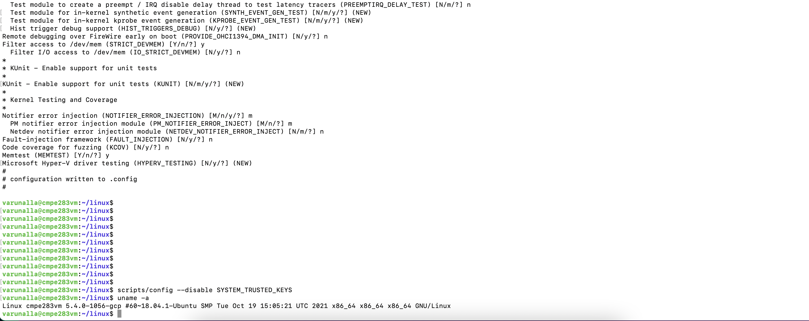
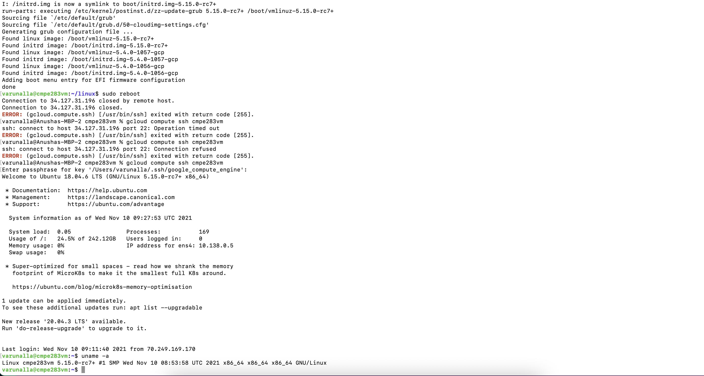

# CMPE 283 Assignment #1:

The Assignment is completed on Google Cloud with nested virtualization. using ubuntu 18.04 image.

## Pre-Requisites:
### Host Environment Setup:

1. Create host gcloud vm with nested virtualization enabled, using ui or use the below command by replacing projectid and service account details

```
$ gcloud compute instances create cmpe283vm --project=${projectname} --zone=us-west1-a --machine-type=n2-standard-8 --network-interface=network-tier=PREMIUM,subnet=default --maintenance-policy=MIGRATE --service-account=${service_account details} --scopes=https://www.googleapis.com/auth/devstorage.read_only,https://www.googleapis.com/auth/logging.write,https://www.googleapis.com/auth/monitoring.write,https://www.googleapis.com/auth/servicecontrol,https://www.googleapis.com/auth/service.management.readonly,https://www.googleapis.com/auth/trace.append --create-disk=auto-delete=yes,boot=yes,device-name=cmpe283vm,image=projects/ubuntu-os-cloud/global/images/ubuntu-1804-bionic-v20211103,mode=rw,size=250,type=projects/cmpe283-330406/zones/us-west1-a/diskTypes/pd-balanced --no-shielded-secure-boot --shielded-vtpm --shielded-integrity-monitoring --reservation-affinity=any --enable-nested-virtualization
```
2. Connect to the created VM, make sure it is started via the cloud console.
```
$ gcloud compute ssh cmpe283vm 
```
3. Check if virtualization is enabled. The command should return non-zero value.
```
$ grep -cw vmx /proc/cpuinfo
```
4. Install utils for future vms.
```
$ sudo apt-get update && sudo apt-get install cloud-image-utils qemu-kvm qemu-utils -y
```

#### Installing Dependencies:
1. Install the dependencies.
```
$ sudo apt-get update
$ sudo apt-get install git fakeroot build-essential ncurses-dev xz-utils libssl-dev bc
$ sudo apt-get install flex bison libelf-dev
```
## Clone Repo:
1. Configure Git. Refer Troubleshoot section for errors.
2. Clone the repo.
```
$ git clone git@github.com:varunalla/linux.git
```
## Copy Config:
1. copy config from guest os and make old config. 
```
$ cp /boot/config-$(uname -r) .config   
$ make oldconfig
```
## Building and Installing Kernel:
1. If you run the following command before building and installing the new kernel, it will show old kernel like sample image below.
```
$ uname -a
```

2. Build the linux kernel along with modules and install. Check Cert Error troubleshooting guide below, if error is thrown during build process. 
```
sudo make modules -j 8
sudo make -j 8 
sudo make INSTALL_MOD_STRIP=1 modules_install -j 8
sudo make install -j 8
```
3. Restart and run the following command. the result should look like the sample image below.
```
$ uname -a
```

## Building Custom Module:
Build the module
```
$ cd cmpe283
$ make
```
## Installing Module:
Load the custom module into the kernel.
```
$ sudo insmod cmpe283-1.ko
```
## Check Status:
To check the log from the module loaded
```
$ dmesg
```
### Guest Environment Setup:
All the instructions are done on HOST OS on Gcloud, for Assignment 2 

1. Download Ubuntu Image.
```
$ wget "https://cloud-images.ubuntu.com/releases/18.04/release/ubuntu-18.04-server-cloudimg-amd64.img"
```
2. Increase image size.
```
$ qemu-img resize "ubuntu-18.04-server-cloudimg-amd64.img" +170G
```
3. create user data file for password. 
```
#cloud-config
password: password
chpasswd: { expire: False }
ssh_pwauth: True
```
4. use cloud tools to create the user data img
```
$ user_data=user-data.img
$ cloud-localds "$user_data" user-data
```
5. run a new screen
```
screen
```
6. Start the VM using qemu with 8 vcpus and 16GB of memory.
```
$ export img=ubuntu-18.04-server-cloudimg-amd64.img
$ sudo qemu-system-x86_64 -enable-kvm -drive "file=${img},format=qcow2" -drive "file=${user_data},format=raw"  -m 16G -smp 8 -nographic
```
7. The Systems will say no boot drive not available. wait for a moment and press key when prompted. 
8. Inside the Guest VM enter the username and password configured.
```
login: ubuntu
password: ${configured-password}
```
## Troubleshooting:
### Cert Error
```
make: *** [Makefile:1809: certs] Error 2
```
run from within linux cloned folder.
```
$ scripts/config --disable SYSTEM_TRUSTED_KEYS
```
### Git Clone Error:
```
Host key verification failed.
```
1. Verify that the ssh keys have been setup correctly.
Run 
```
ssh-keygen
Enter the password (keep the default path - ~/.ssh/id_rsa)
```
2. Add the public key (~/.ssh/id_rsa.pub) to github account

# Assignment 2:
## Modifications to kvm files.
1. Modified File lists from cloned linux folder
```
arch/x86/kvm/cpuid.c
arch/x86/kvm/vmx/vmx.c
```
2. Make the modules after modifications
```
sudo make -j 8 modules
sudo make modules_install -j 8
```
3. to remove the kvm module and reinject it
```
sudo rmmod kvm_intel
sudo rmmod kvm
sudo modprobe kvm
sudo modprobe kvm_intel
```
4. To make sure if kvm is loaded or not
```
lsmod | grep kvm
```
example result is
```
kvm_intel             258048  10
kvm                   876544  1 kvm_intel
```

## Code to run inside qemu vm
Follow steps to run vm inside vm in the above section.
1. Install cpuid package
```
sudo apt-get update -y
sudo apt-get install -y cpuid
```
2. Copy the file or create it the file and copy the contents inside the qemu vm
```
cmpe283/assignment2/cmpe283-2.c
```
3. Compile the file
```
gcc cmpe283-2.c
```
4. Execute the file
```
./a.out
```
5. Sample Result
```
total exit count is 1847056
total cpu cycles spent in vmexits  6373159472
```
# Assignment 3:
## Modifications to kvm files.
1. Modified File lists from cloned linux folder
```
arch/x86/kvm/cpuid.c
arch/x86/kvm/vmx/vmx.c
```
2. Copy the file or create it the file and copy the contents inside the qemu vm
```
cmpe283/assignment3/cmpe283-3.c
```
3. Compile the file
```
gcc cmpe283-3.c
```
4. For all exits
```
./a.out
```
```
CPUID(0x4fffffff) total exit count is 1772688
CPUID(0x4ffffffe) total cpu cycles spent in vmexits  6290552396
```
5. For details for specific reason
```
./a.out 10
```
```
CPUID(0x4ffffffd) Exit Count for the reason  10 is 230044 
CPUID(0x4ffffffc) time spent by vmm for the reason  10 is 196066914 cycles
```

