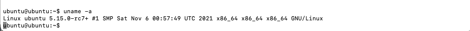

# CMPE 283 Assignment #1:

The Assignment is completed on Google Cloud with nested virtualization.

## Pre-Requisites:
### Host Environment Setup:

1. Create host gcloud vm with nested virtualization enabled.
```
$ gcloud compute instances create cmpe283vm --project=${projectname} --zone=us-west1-a --machine-type=n2-standard-8 --network-interface=network-tier=PREMIUM,subnet=default --maintenance-policy=MIGRATE --service-account=${service_account details} --scopes=https://www.googleapis.com/auth/devstorage.read_only,https://www.googleapis.com/auth/logging.write,https://www.googleapis.com/auth/monitoring.write,https://www.googleapis.com/auth/servicecontrol,https://www.googleapis.com/auth/service.management.readonly,https://www.googleapis.com/auth/trace.append --create-disk=auto-delete=yes,boot=yes,device-name=cmpe283vm,image=projects/ubuntu-os-cloud/global/images/ubuntu-1804-bionic-v20211103,mode=rw,size=250,type=projects/cmpe283-330406/zones/us-west1-a/diskTypes/pd-balanced --no-shielded-secure-boot --shielded-vtpm --shielded-integrity-monitoring --reservation-affinity=any --enable-nested-virtualization
```
2. Connect to the created VM.
```
$ gcloud compute ssh cmpe283vm 
```
3. Check if virtualization is enabled. The command should return non-zero value.
```
$ grep -cw vmx /proc/cpuinfo
```
4. Install utils.
```
$ sudo apt-get update && sudo apt-get install cloud-image-utils qemu-kvm qemu-utils -y
```
### Guest Environment Setup:
All the instructions are done on HOST OS on Gcloud

1. Download Ubuntu Image.
```
$ wget "https://cloud-images.ubuntu.com/releases/18.04/release/ubuntu-18.04-server-cloudimg-amd64.img"
```
2. Increase image size.
```
$ qemu-img resize "ubuntu-18.04-server-cloudimg-amd64.img" +170G
```
3. create user data file for password. 
```
#cloud-config
password: password
chpasswd: { expire: False }
ssh_pwauth: True
```
4. use cloud tools to create the user data img
```
$ user_data=user-data.img
$ cloud-localds "$user_data" user-data
```
5. run a new screen
```
screen
```
6. Start the VM using qemu with 8 vcpus and 16GB of memory.
```
$ sudo qemu-system-x86_64 -enable-kvm -drive "file=${img},format=qcow2" -drive "file=${user_data},format=raw"  -m 16G -smp 8 -nographic
```
7. The Systems will say no boot drive not available. wait for a moment and press key when prompted. 
8. Inside the Guest VM enter the username and password configured.
```
login: ubuntu
password: ${configured-password}
```
#### Installing Dependencies:
1. Install the dependencies.
```
$ sudo apt-get update
$ sudo apt-get install git fakeroot build-essential ncurses-dev xz-utils libssl-dev bc
$ sudo apt-get install flex bison libelf-dev
```
## Clone Repo:
1. Configure Git
2. clone the git
```
$ git clone git@github.com:varunalla/linux.git
```
## Copy Config:
1. copy config from guest os and make old config. 
```
$ cp /boot/config-$(uname -r) .config   
$ make oldconfig
```
## Building and Installing Kernel:
1. Build the linux kernel along with modules and install
```
sudo make modules -j 8
sudo make -j 8 
sudo make INSTALL_MOD_STRIP=1 modules_install -j 8
sudo make install -j 8
```
2. Restart and run the following command.
```
$ uname -a
```
3. the result should look like the image below.

## Building Custom Module:
Build the module
```
$ cd cmpe283
$ make
```
## Installing Module:
Load the custom module into the kernel.
```
$ sudo insmod cmpe283-1.ko
```
## Check Status:
To check the log from the module loaded
```
$ dmesg
```
## Troubleshooting:
### Cert Error
```
make: *** [Makefile:1809: certs] Error 2
```
run from within linux cloned folder.
```
$ scripts/config --disable SYSTEM_TRUSTED_KEYS
```
